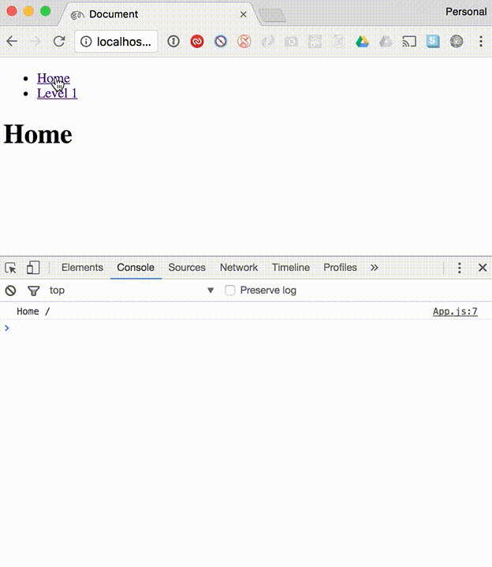

# React Router V4 Nested Switch Back Button Bug

This is an example app demonstrating a bug I have observed with nested `<Switch>` components in [React Router V4](https://github.com/ReactTraining/react-router/tree/v4).

When the back button is pressed, the parent route component and current component is re-rendered twice as demonstrated in this example:

